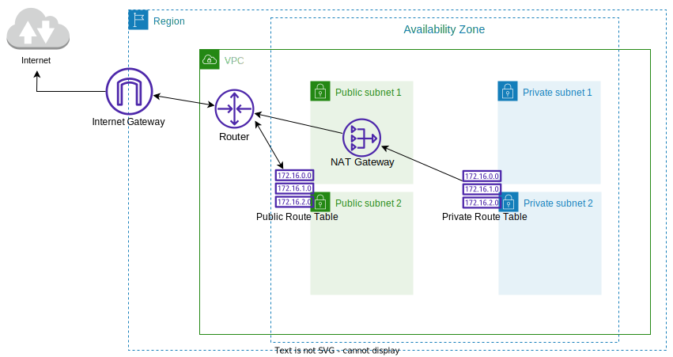

# Terraform VPC Module

## Module Input Variables

- vpc_cidr_block 
- pub_1_cidr   (CIDR for public subnet 1) 
- pub_2_cidr   (CIDR for public subnet 2) 
- priv_1_cidr  (CIDR for private subnet 1) 
- priv_2_cidr  (CIDR for private subnet 2) 
  

> Optional Availability Zone variables for subnets:
- pub_1_az (Optional)   
- pub_2_az (Optional)   
- priv_1_az (Optional)   
- priv_2_az (Optional)   
  

## Resources created by Module are as follows:

